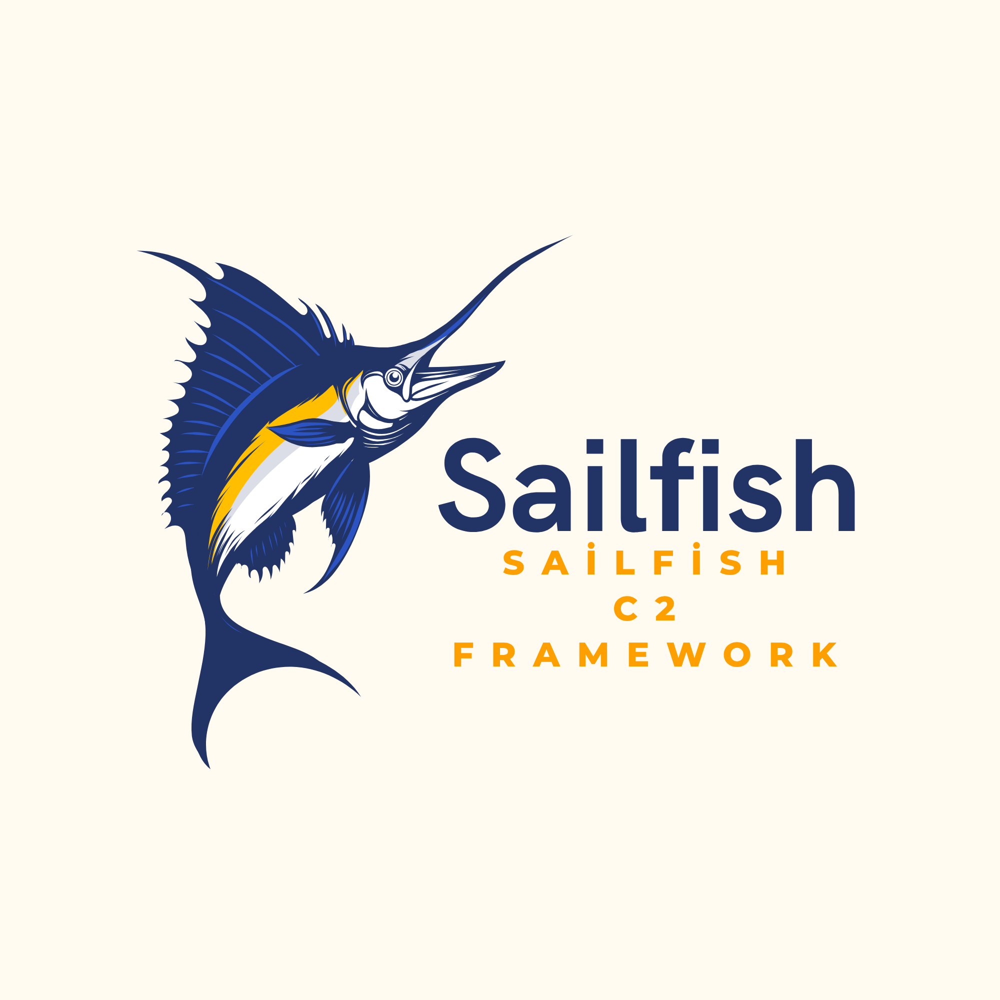

# SailFish
 **Don't you worry, it's gonna be like I'm not even here**

-Lalo Salamanca
 
  [](https://www.gnu.org/licenses/agpl-3.0)
  [](http://makeapullrequest.com)
  [](http://makeapullrequest.com)
  [](http://makeapullrequest.com)

A keylogger C2 (Command & Control) tool developed for red team operations and educational research. It uses Telegram as its C2 channel and encrypts data with a Base64 + XOR combination. 


<div align="center">

  

## Features
* **Telegram C2 Integration:** Communication over Telegram Bot API.
* **Layered Encryption:** Data obfuscation via Base64 + XOR encryption.
* **Low Footprint:** Written in C with minimal external dependencies for performance.
* **Red Team Focused:** Designed for educational research and OffSec training.


Installation

```
#dowland
git clone https://github.com/hackpatato/SailFish-C2-Framework.git
cd SailFish-C2-Framework
#for debian
sudo apt install mingw-w64
#for arch
sudo pacman -S mingw-w64-gcc
#for fedora
sudo dnf install mingw64-gcc
#build
x86_64-w64-mingw32-gcc *.c -Iinclude -o SailFish.exe -mwindows
```
